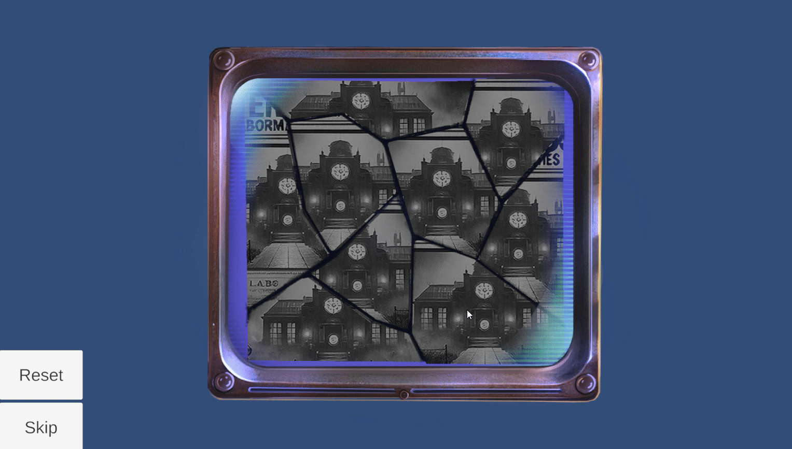

# **Archive Puzzle**

**Type**: Drag-and-Drop Puzzle

**Goal**: Reconstruct the cracked image by moving the pieces to their correct positions

### 🎮 Gameplay Description

- The puzzle consists of **3 levels**, each with a cracked image divided into multiple pieces.

- Each piece can be **dragged and dropped** to the correct location.

- The objective is to **reassemble the full image** for each level.

- Each level is **similar in mechanics** but features a different image.

### 🛠 Implementation Notes

- Each puzzle piece is a separate GameObject with a script controlling drag-and-drop behavior.

- Snap-to-grid or position checking ensures that pieces **snap into place** when close to the correct position.

- Puzzle completion is detected when **all pieces are correctly placed** for that level.

### 🎬 Demo / GIF

### 💡 Notes / Highlights

- Multi-level design demonstrates **modularity and reuse**.

- The puzzle includes **Reset** and **Skip** buttons, allowing players to restart the puzzle or move past it if needed.