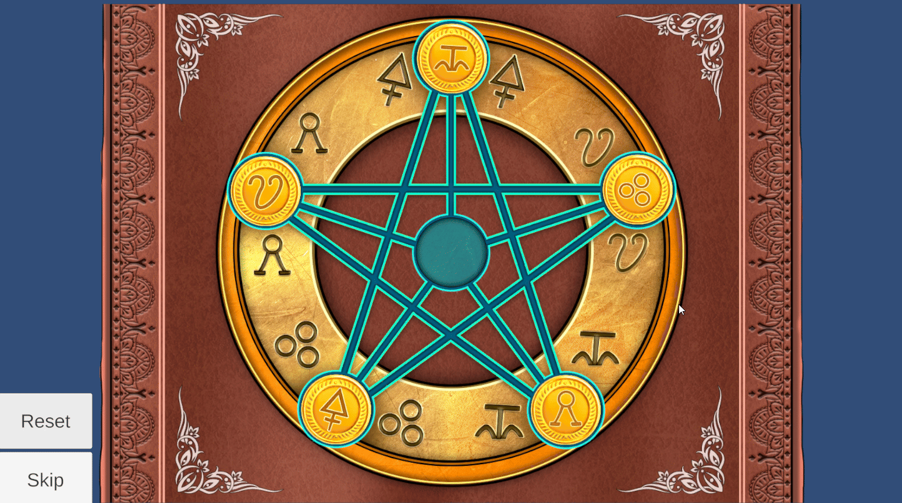

# **Book Puzzle**

**Type**: Coin Puzzle

**Goal**: Move each coin to its corresponding correct position on the star

### 🎮 Gameplay Description

- The puzzle consists of **5 coins** and **6 positions** forming a star pattern.

- When a coin is clicked, it **moves to a connected free position** based on its current location:

  - For example, a coin at the top of the star is connected to the positions at the lower star arms and the center.

  - If a connected position is free, the coin moves there; otherwise, it **shakes** to indicate it cannot move.

- **Objective**: Each coin must be placed on the position that **matches its symbol**.

### 🛠 Implementation Notes

- Movement is implemented using **DOTween**.

- Each coin keeps track of its **current position** and **connected positions**.

- Puzzle completion is detected when **all coins are on their correct positions**.

### 🎬 Demo / GIF

### 💡 Notes / Highlights

- Shows **interactive feedback** when invalid moves are attempted.

- The puzzle includes **Reset** and **Skip** buttons, allowing players to restart the puzzle or move past it if needed.