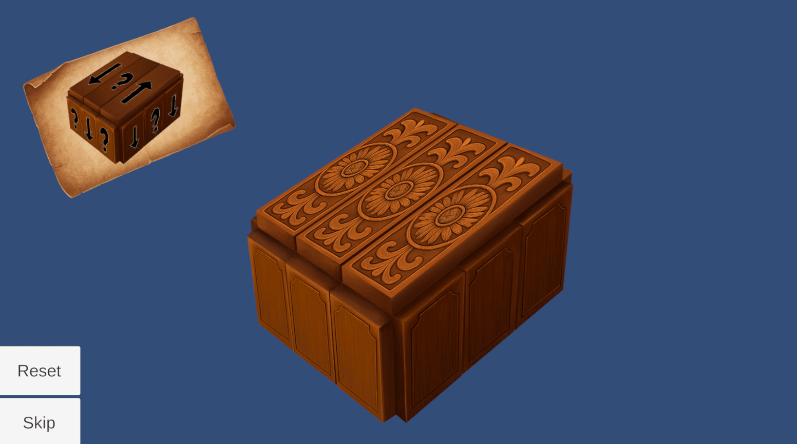

# **Box Puzzle**

**Type**: Sliding Puzzle

**Platform**: Unity (2D, simulated 3D perspective)

**Goal**: Move each plank to its correct position to complete the cube

🎮 **Gameplay Description**

- The puzzle consists of a cube made of 9 planks.

- Each plank can be moved along a specific axis (up-down, forward-back, or left-right depending on its rotation in the scene).

- The cube is slightly rotated to give a 3D perspective, but all interactions happen in 2D space.

- A reference image of the cube is displayed on the screen, showing the correct positions for each plank.

🛠 **Implementation Notes**

- Each plank is a separate GameObject with its own script controlling drag behavior along its allowed axis.

- Puzzle completion is detected when all 9 planks are in their correct positions.

🎬 **Demo / GIF**

💡 **Notes / Highlights**

- Uses axis-constrained dragging to simulate 3D movement in 2D space.

- The puzzle includes **Reset** and **Skip** buttons, allowing players to restart the puzzle or move past it if needed.