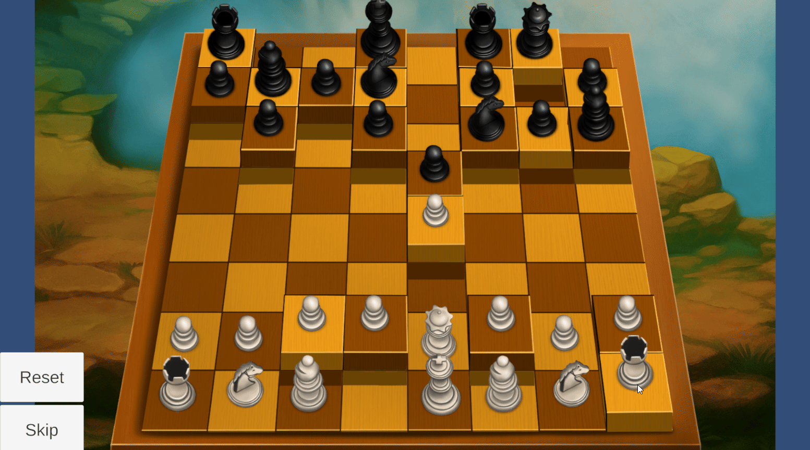

# **Chess Minigame**

**Type**: Chess Logic / Placement Puzzle

**Goal**: Place all white pieces in their correct positions using chess movement rules

### 🎮 Gameplay Description

- The puzzle uses a **chessboard with all standard pieces**.

- Each piece moves according to **standard chess rules**.

- When a piece is dragged, the **valid move squares are highlighted**.

- If the piece is dropped on an **invalid square**, it returns to its original position.

- Correctly placed pieces **lock in place**, requiring strategic planning to avoid blocking other pieces prematurely.

- The focus is not combat or battling.

### 🛠 Implementation Notes

- Piece movement is implemented with **drag-and-drop** scripts that check for valid chess moves.

- **Object-oriented design**:

  - A **BasePiece class** defines common movement and interaction logic.

  - All specific piece classes **inherit from BasePiece** and **override functions** where needed for unique movement patterns.

- Highlighting of valid squares is handled by **grid-based logic** and **visual feedback**.

### 🎬 Demo / GIF

### 💡 Notes / Highlights

- OOP design that demonstrates **code reusability**.

- The puzzle includes **Reset** and **Skip** buttons, allowing players to restart the puzzle or move past it if needed.