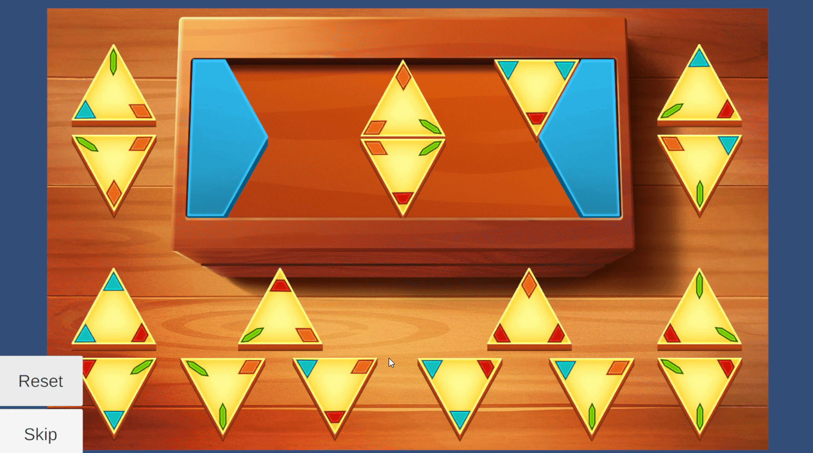

# **Dominoes Puzzle**

**Type**: Color Matching / Placement Puzzle

**Goal**: Arrange triangular tiles so that adjacent sides have matching colors

### 🎮 Gameplay Description

- The puzzle consists of **triangular tiles**, each with a **color at each corner**.

- Objective: Place the triangles onto the board so that **adjacent sides of neighboring triangles have matching colors**.

- Placement rules:

  - A triangle can only be placed **if all its edges match the colors of the adjacent tiles**.

- Puzzle emphasizes **pattern recognition**, similar to a triangular version of dominoes.

### 🛠 Implementation Notes

- Tile placement uses **drag-and-drop mechanics**.

- Each tile tracks its **color for each corner** and **valid placement positions**.

- Placement validation checks that **all neighboring sides match colors**.

### 🎬 Demo / GIF

### 💡 Notes / Highlights

- The puzzle includes **Reset** and **Skip** buttons, allowing players to restart the puzzle or move past it if needed.