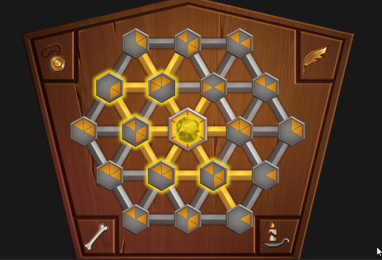

# **Enchantment Table**

**Type**: Rotation / Light Propagation Puzzle

**Goal**: Illuminate all hexagons by properly rotating them

### 🎮 Gameplay Description

- The puzzle consists of multiple **hexagons** connected by **paths**.

- Each hexagon contains a number of **triangles** (up to 6) that act as light **receivers** and **emitters**.

- There is a **central hexagon** in the middle, which is the **source of light**.

- A hexagon is **illuminated** only if light reaches **one of its triangles**.

- When a hexagon is illuminated, its triangles become **new** light emitters, **propagating** light further along **connected paths**.

### 🛠 Implementation Notes

- Hexagons track current **rotation** and **light-emitting** triangles.

- Rotation is triggered by **clicking** on the hexagon, rotating it by **60 degrees** per click.

- Light propagation is computed through **connected** paths, updating illumination **dynamically**.

### 🎬 Demo / GIF

### 💡 Notes / Highlights
- This puzzle was created during my initial training at Vincell Studios.
It does not strictly follow the standard folder and script structure used in other puzzles.