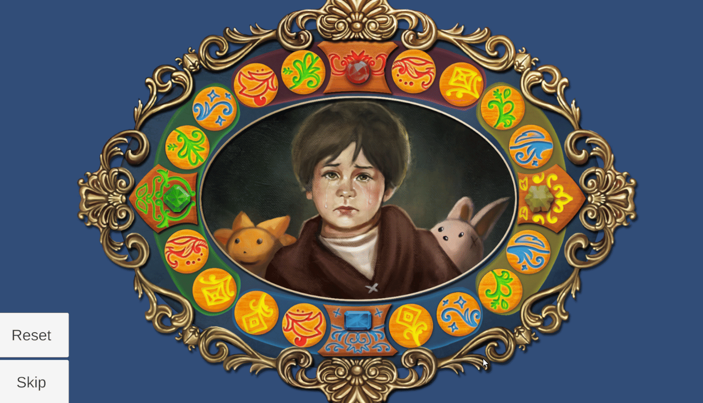

# **Painting Puzzle**

**Type**: Color Matching / Swap Puzzle

**Goal**: Arrange circles of the same color to their corresponding positions

### 🎮 Gameplay Description

- The puzzle features 16 circular pieces in 4 **different colors**.

- Players must **swap** pieces so that all pieces of the same color are positioned correctly.

- Each color has 4 target positions, marked by **jewels** that correspond to that color.

- When all pieces of a color are correctly placed, they become **fixed** and the corresponding jewel **lights up**.

### 🛠 Implementation Notes

- Swapping is implemented using **DOTween** animations.

- Each piece **tracks** its current position and target color positions.

- Puzzle completion is detected when all pieces of all colors are in their correct positions.

### 🎬 Demo / GIF

### 💡 Notes / Highlights

- The puzzle includes **Reset** and **Skip** buttons, allowing players to restart the puzzle or move past it if needed.