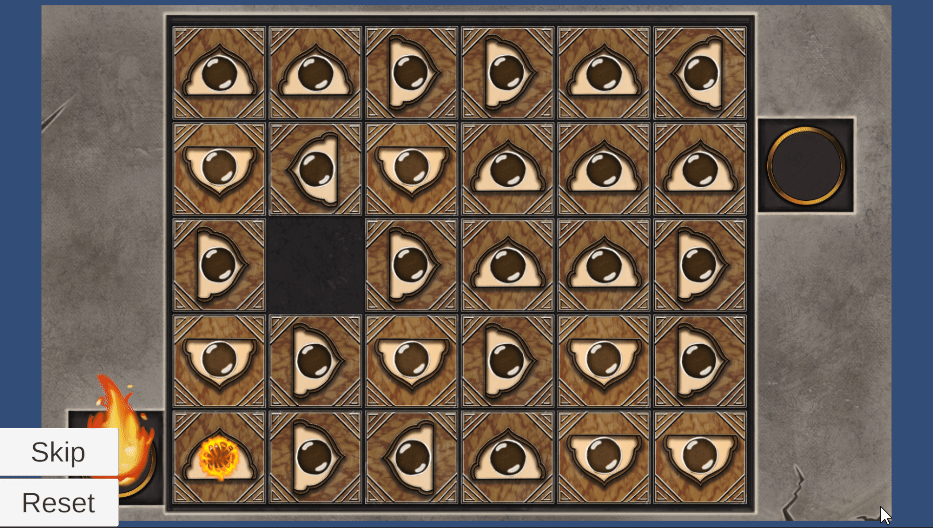

# **Path Fixing Puzzle**

**Type**: Grid / Path Puzzle

**Goal**: Direct fire through all tiles to reach the target position

### 🎮 Gameplay Description

- The puzzle consists of a grid of **square tiles**, each with **arrows** pointing up, down, left, or right.

- There is a starting point of **fire in one corner**.

- Each tile **propagates fire** in the **direction of its arrow**.

- Objective: Swap tiles so that the fire flows from the **start** to the **end** point, passing through **all** tiles.

### 🛠 Implementation Notes

- Fire propagation is implemented with **grid-based logic**, following arrows on each tile.

- Tiles can be swapped using DOTween to **reconfigure** the path.

### 🎬 Demo / GIF

### 💡 Notes / Highlights
- Shows **interactive grid manipulation**
- The puzzle includes **Reset** and **Skip** buttons, allowing players to restart the puzzle or move past it if needed.