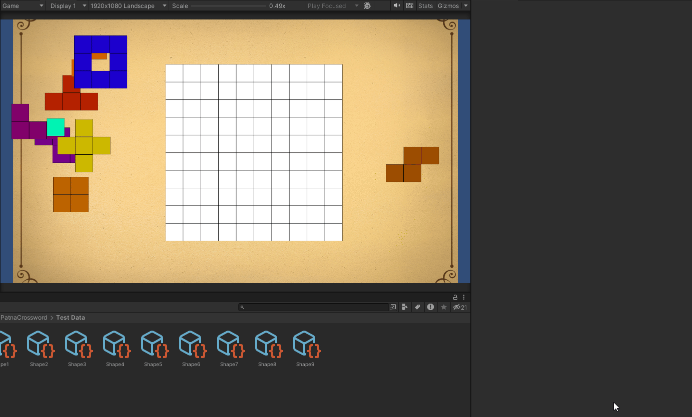

# **Patna Crossword Framework**

**Type**: Internal Puzzle Framework

**Role**: Core system and tools development

 

### 🧩 Overview

The **Patna Crossword Framework** is a system built to streamline the creation of **grid-based puzzles** within Unity.
It allows designers to visually define **custom shapes** and **grids** directly from the **editor**, which enables **reusability** across multiple puzzle types.

Originally developed as part of the company's **internal puzzle toolkit.**
This framework became the foundation for many in-game puzzles, because it requires only changes in art or data for new variations.
 
 

### ⚙️ Core Functionality
- **Custom Grid Creation:**

A flexible grid system can be **generated** through a dedicated ScriptableObject editor.
**Designers** can select **any** combination of cells to define a **custom puzzle shape**.

- **Shape Generation:**

When the puzzle runs, all shapes are automatically **instantiated from the data stored in the ScriptableObject** list.

- **Collision System:**

Implemented a **custom collision detection** system that manages **interactions** between dynamically generated shapes.

- **Drag & Drop System:**

Built a smooth, **grid-aware drag and drop** mechanism, allowing users to reposition shapes intuitively.

- **Snap-to-Grid System:**

Ensures that all shapes precisely **align** with grid coordinates upon release.

- **Custom Grid Shapes:**

The grid itself supports **non-standard geometries** and can be designed through the same ScriptableObject workflow.

 

### 💡 Technical Highlights

- Fully **data-driven**, **modular** architecture.

- **Editor tooling** for quick configuration and designer autonomy.

- Clean **OOP** design with reusable components for grid logic, input handling, and collisions.

- **Minimalist** visual prototype in the **scene** for testing and debugging, easily adaptable for production visuals.

- **Widely used internally** for **rapid** puzzle customization and **prototyping**.

### 🎬 Demo / GIF

