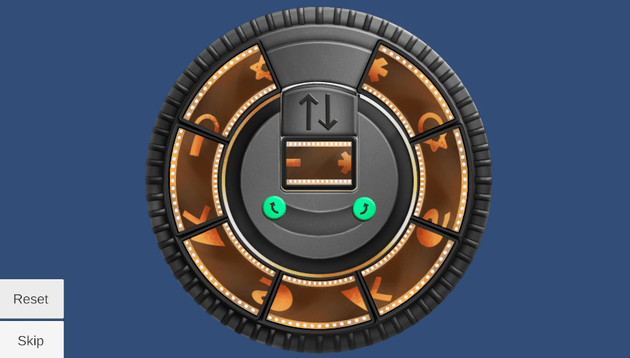

# **Projector Slide Puzzle**

**Type**: Rotation / Matching Puzzle

**Goal**: Align tiles so that symbols match correctly

### 🎮 Gameplay Description

- The puzzle features a **wheel** of tiles and a **central** rectangular tile.

- Each tile has **symbols on its sides**, e.g., half-circles that must **connect** with corresponding halves on **adjacent** tiles.

- Controls:

  - Pressing a **rotate button** rotates the wheel of tiles.

  - Pressing a **swap button** moves the central tile to the top position; if a tile is already there, the two tiles **swap** positions.

### 🛠 Implementation Notes

- Tiles track their current orientation and neighbors for matching.

- Rotation and swapping use button-based input logic with animations.

### 🎬 Demo / GIF

### 💡 Notes / Highlights

- The puzzle includes **Reset** and **Skip** buttons, allowing players to restart the puzzle or move past it if needed.