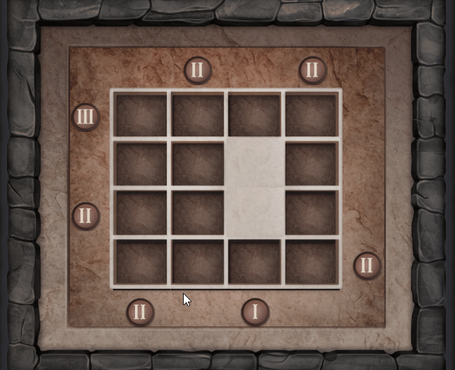

# **Secret Door**

**Type**: Block Pushing Puzzle

**Goal**: Use all blocks from buttons to fill the grid

### 🎮 Gameplay Description

- The puzzle consists of a grid of **rectangles** with **buttons** at certain positions.

- Each button displays the number of **remaining** blocks it can **generate**.

- Objective: Press buttons to spawn blocks and **move** them along the grid (up, down, left, or right) depending on the button's position.

- Blocks **push** other blocks if there is an obstacle in their path.

- **Misplacing** blocks can leave some buttons unable to spawn further blocks.

### 🛠 Implementation Notes

- Blocks track their current **position** and movement **direction**.

- Buttons track their remaining **block count**.

- Movement is handled via coroutines, resolving collisions and pushes dynamically.

### 🎬 Demo / GIF

### 💡 Notes / Highlights
- This puzzle was created during my initial training at Vincell Studios.
It does not strictly follow the standard folder and script structure used in other puzzles.
- The puzzle includes **Reset** button, allowing players to restart the current level.