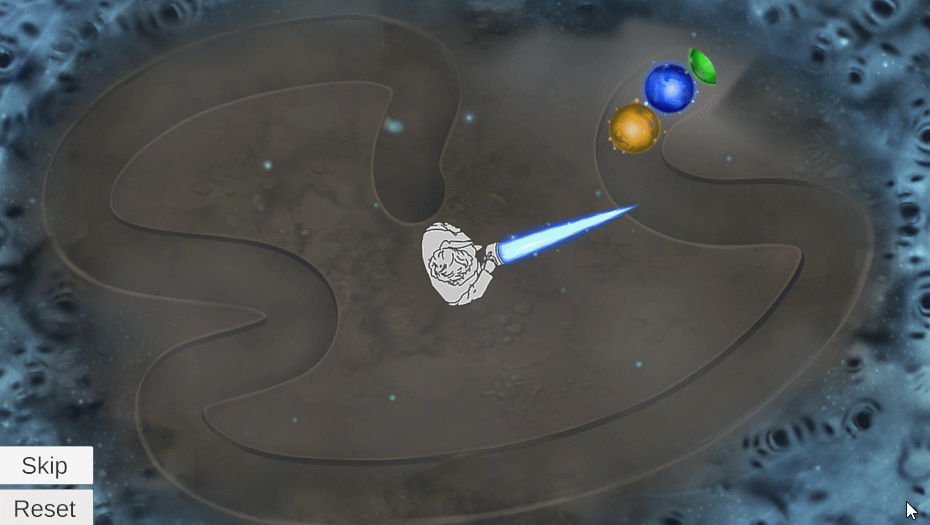

# **Soul Boss Minigame**

**Type**: Match-3 / Zuma-style Minigame

**Goal**: Destroy sequences of 3 or more balls before they reach the end

### 🎮 Gameplay Description

- This puzzle has a **Zuma-style** gameplay scenario: a train of **colored** balls moves along a **path** toward a goal.

- Objective: **Shoot** or **insert** new balls to create sequences of 3 or more of the same color, which destroy the balls.

### 🛠 Implementation Notes

- Balls are spawned **dynamically** along a predefined path.

- Insertion logic allows new balls to **merge** into the moving train.

- Matching logic detects **sequences of 3 or more** balls of the same color and **removes** them from the train.

- Puzzle completion is detected when all balls are cleared or the train reaches the endpoint.

### 🎬 Demo / GIF

### 💡 Notes / Highlights
- Shows **Zuma-style mechanics, timing, and chain reaction handling**.
- The puzzle includes **Reset** and **Skip** buttons, allowing players to restart the puzzle or move past it if needed.