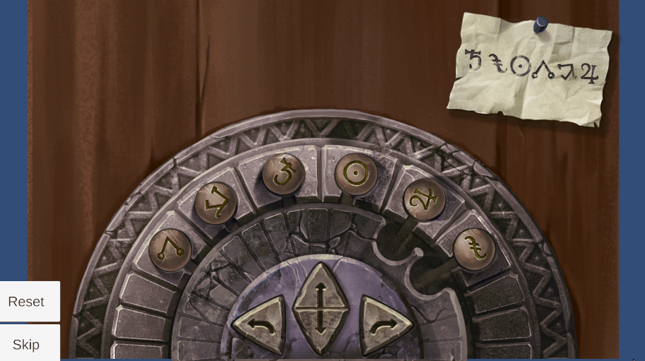

# **Wall Puzzle**

**Type**: Rotation / Symbol Matching Puzzle

**Goal**: Arrange stones on a wheel to match the pattern shown on the clue

### 🎮 Gameplay Description

- The puzzle features a wheel with fixed positions for stones.

- There is a **clue** that displays the **target arrangement** of the stones.

- **Wheel mechanics**:

  - The wheel can **rotate** using a button.

  - Two empty **slots** exist on the wheel.

- When a **swap** button is pressed:

  - Two stones **previously taken** are placed in the top positions.

  - If the wheel slots are **empty**, stones from fixed positions drop into the **rotating** section.

  - If both wheel and top slots are **full**, the stones **swap** places.

### 🛠 Implementation Notes

- Stones track **current positions** and **symbol types**.

- Rotation and placement use button input logic with **DOTween** animations.

### 🎬 Demo / GIF

### 💡 Notes / Highlights

- The puzzle includes **Reset** and **Skip** buttons, allowing players to restart the puzzle or move past it if needed.