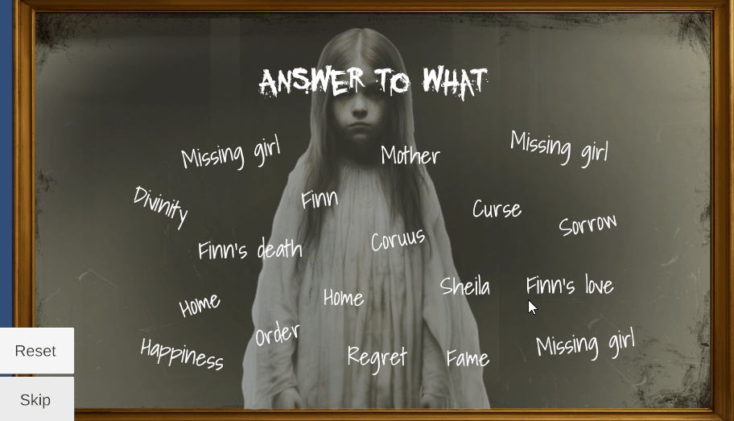

# **Word Minigame**

**Type**: Pattern Recognition / Reaction Puzzle

**Goal**: Click on the word that appears most frequently on the screen

### 🎮 Gameplay Description

- In this puzzle, there are multiple words present on a screen.

- The minigame contains 3 levels with increasing difficulty:
  - Level 1: Words are static.

  - Level 2: Words move across the screen.

  - Level 3: Words move and blink, making them harder to track.

### 🛠 Implementation Notes

- Movement and blinking are implemented using **DOTween**.

- Level **progression** is handled when the player successfully identifies the correct word.

### 🎬 Demo / GIF

### 💡 Notes / Highlights

- The puzzle includes **Reset** and **Skip** buttons, allowing players to restart the puzzle or move past it if needed.